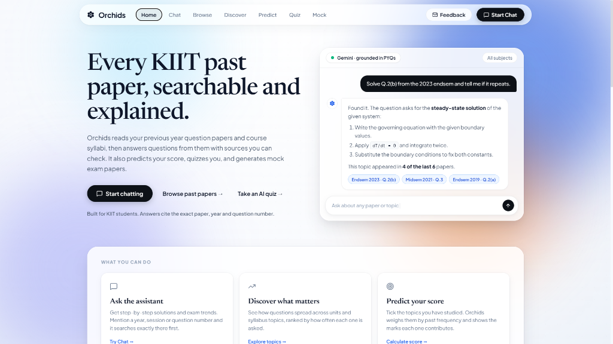
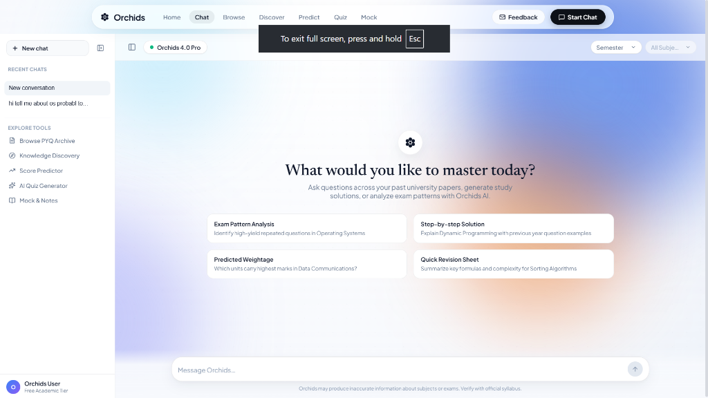

# 🌸 Orchids — KIIT University PYQ AI Assistant & Exam Intelligence Platform

[](https://python.org)
[](https://djangoproject.com)
[](https://reactjs.org)
[](https://vitejs.dev)
[](https://katex.org)
[](https://trychroma.com)
[](https://ai.google.dev)
[](https://www.reportlab.com)

**Orchids** is a comprehensive, production-grade AI Exam Preparation and Academic Intelligence Platform built specifically for students at **KIIT (Kalinga Institute of Industrial Technology)**. It indexes years of university Previous Year Question (PYQ) papers and official course syllabi into a persistent vector database (ChromaDB) and relational metadata store (SQLite).

Beyond simple search, Orchids provides **grounded multi-model AI reasoning**, **syllabus-aligned unit & topic analytics**, an **interactive weighted score predictor**, an **AI-powered MCQ quiz generator**, a **full-fledged University Mock Exam Generator with dual LaTeX-styled Question Paper & Solution PDF downloads**, a **fast in-browser document reader**, and an **integrated student feedback system**.

---

## 📸 Visual Glimpse

### 🏠 Landing Page & Examination Overview


### 💬 Grounded AI Chat & Study Workspace


---

## 🌟 Key Features & How Each Feature Works

### 1. 💬 Grounded RAG AI Assistant (`/chat`)
- **What It Does**: Provides step-by-step conceptual explanations, mathematical derivations, historical question trends, and exam predictions with verifiable source citations.
- **How It Works**:
  1. **Intent & Filter Parsing**: Detects temporal intents (e.g., `2018` to `2024`), exam sessions (`Midsem`, `Endsem`, `Supplementary`), and specific question indices (`Q.1`, `Q.4(b)`) using regex matchers.
  2. **Dense Vector Search**: Converts user queries into 384-dimensional embeddings via `sentence-transformers/all-MiniLM-L6-v2` and retrieves top-k relevant question chunks from persistent ChromaDB collections.
  3. **Context-Grounded LLM Synthesis**: Supplies retrieved chunks along with structured syllabus units to the **Google Gemini API** (`gemini-3.5-flash-lite`, `gemini-3.6-flash`, `gemini-3.5-flash`, `gemini-flash-latest`).
  4. **Formula & Code Rendering**: Renders mathematical equations dynamically via client-side **KaTeX** (`<MathRenderer />`) supporting inline math (`$...$`) and block math (`$$...$$`).

---

### 2. 📑 University Mock Exam Generator (`/mock`)
- **What It Does**: Generates authentic, full-length university examination papers following the official KIIT examination blueprint, complete with live in-browser preview and downloadable dual PDFs.
- **How It Works**:
  1. **Automated Syllabus Scoping**:
     - **Midsem Exam (Total: 20 Marks | 1.5 Hours)**: Automatically scopes questions strictly to the **first half of the course syllabus** (e.g., 3 out of 6 units, or 2.5 of 5 units).
     - **Endsem Exam (Total: 50 Marks | 3.0 Hours)**: Scoped across the **entire course syllabus** (100% of all units & topics).
  2. **Authentic Examination Blueprint**:
     - **Midsem Structure**:
       - `Q.1 (Compulsory)`: 5 sub-questions $\times$ 1 Mark = **5 Marks**.
       - `Q.2 to Q.5 (Long Questions)`: 4 questions of 5 Marks each (with sub-parts (a) and (b)). Student answers any **3** out of 4 = **15 Marks**.
       - **Total**: $5 + (3 \times 5) = 20\text{ Marks}$.
     - **Endsem Structure**:
       - `Q.1 (Compulsory)`: 10 sub-questions $\times$ 1 Mark = **10 Marks**.
       - `Q.2 to Q.7 (Long Questions)`: 6 questions of 10 Marks each (with sub-parts summing to 10 marks). Student answers any **4** out of 6 = **40 Marks**.
       - **Total**: $10 + (4 \times 10) = 50\text{ Marks}$.
  3. **LaTeX Math Rendering in PDFs**:
     - Server-side Matplotlib mathtext rasterizer converts mathematical formulas (`\frac{...}{...}`, `\int`, `\sigma`, `\nabla`) into transparent PNGs with exact physical point scaling (`points = pixels * 72 / DPI`) to ensure natural 10.5pt typography within ReportLab PDFs.
  4. **Dual PDF Compilation**:
     - 📄 **Question Paper PDF (`mock_qp_*.pdf`)**: University headers, course codes, time limits, instructions, right-aligned mark brackets `[5]`, and choices.
     - 📝 **Answer Key & Marking Scheme PDF (`mock_ans_*.pdf`)**: Step-by-step mathematical working, key conceptual points, final answers, and explicit marking rubrics.

---

### 3. 📊 Knowledge Discovery & Syllabus Intelligence (`/discover`)
- **What It Does**: Visualizes historical question distributions, topic frequencies, and module weights across past university exams.
- **How It Works**:
  1. Aggregates question chunks classified by unit and topic from ChromaDB metadata.
  2. Computes topic frequency counts and relative distribution percentages.
  3. Renders visual bar charts and topic breakdowns highlighting high-yield units and recurring exam questions.

---

### 4. 🎯 Interactive Weighted Score Predictor (`/predict`)
- **What It Does**: Allows students to select the topics they have prepared and instantly calculates their expected exam marks based on historical question paper trends.
- **How It Works**:
  1. Computes historical statistical mark weights for each syllabus topic:
     $$W_i = \frac{\text{Count}(T_i)}{\sum_{j} \text{Count}(T_j)}$$
  2. As students toggle topics in the interactive syllabus checklist, the system computes the predicted score:
     $$\text{Predicted Score} = \text{Total Marks} \times \sum_{i \in \text{Studied}} W_i$$
  3. Dynamically updates readiness percentages, unit-by-unit contribution bars, and confidence gauges.

---

### 5. 📝 AI MCQ Quiz Generator & Evaluator (`/quiz`)
- **What It Does**: Generates topic-targeted multiple-choice quizzes with automated grading, instant feedback, and detailed conceptual rationales.
- **How It Works**:
  1. Sends a structured schema request to Gemini grounded in syllabus topic descriptions.
  2. Validates 4 distinct options (A, B, C, D) and ensures exact key-to-answer alignment.
  3. Renders interactive card-based question cards with immediate option reveal, timer tracking, and a final comprehensive scorecard.

---

### 6. 📚 Semester & Subject Document Catalog (`/browse`)
- **What It Does**: Allows students to browse all previous year question papers and syllabus documents organized by semester (1st through 8th).
- **How It Works**:
  1. Queries SQLite for subject metadata, total paper counts, available exam years, and document types.
  2. Provides an in-browser plain-text viewer (`/browse/document/<id>/`) for quick question preview.
  3. Supports direct PDF file streaming downloads (`/browse/document/<id>/download/`) directly from disk storage.

---

### 7. 📬 Integrated Student Feedback System
- **What It Does**: Provides an immediate channel for university students to submit feedback, report missing papers, or request feature enhancements.
- **How It Works**:
  - Accessible via the dedicated **Feedback** button in the top navigation bar on desktop and the slide-out navigation drawer on mobile.
  - Automatically launches Gmail web client with pre-configured recipient address (`2305113@kiit.ac.in`) and pre-filled subject line (`Feedback for Orchids`).

---

### 8. ⚙️ Automated Ingestion & Syllabus Parsing Pipeline
- **What It Does**: Extracts text from raw PDF papers, splits questions into semantic sub-parts, structures syllabi, and auto-tags question chunks.
- **How It Works**:
  1. **Text & OCR Extraction**: Reads text using `PyPDF` and falls back to `PDF2Image` + `Tesseract-OCR` for scanned papers.
  2. **Regex Sub-question Chunking**: Identifies question headers (`Q.1(a)`, `2. (b)`) to split papers into self-contained sub-question chunks.
  3. **Syllabus Structuring**: Extracts course units and topic lists into structured JSON cache files (`syllabus_cache/<subject>.json`) via Gemini.
  4. **LLM Unit/Topic Tagging**: Executes batch classification prompts associating each question chunk with its corresponding syllabus unit and topic.

---

## 🏗️ System Architecture

```
                                  +---------------------------------------+
                                  |       KIIT Syllabus & PYQ PDFs        |
                                  +---------------------------------------+
                                                      |
                                                      v
                                  +---------------------------------------+
                                  |      INGESTION & OCR PIPELINE         |
                                  | (PyPDF, Tesseract OCR, Poppler)       |
                                  +---------------------------------------+
                                            |                         |
                                            v                         v
                          +-------------------+             +-------------------+
                          | Sub-question RegEx|             |  Syllabus Parser  |
                          |    Chunking       |             |   (Gemini JSON)   |
                          +-------------------+             +-------------------+
                                    |                                 |
                                    v                                 v
                          +-------------------+             +-------------------+
                          |SentenceTransformer|             |   Unit & Topic    |
                          | (all-MiniLM-L6-v2)|             |  Auto-Classifier  |
                          +-------------------+             +-------------------+
                                    |                                 |
                                    +----------------+----------------+
                                                     |
                                                     v
                                  +-------------------------------------+
                                  |         PERSISTENT STORAGE          |
                                  |  - ChromaDB (384-dim Embeddings)    |
                                  |  - SQLite (Metadata & Subjects)     |
                                  +-------------------------------------+
                                                     |
                    +--------------------------------+--------------------------------+
                    |                                |                                |
                    v                                v                                v
      +---------------------------+    +---------------------------+    +---------------------------+
      |      RAG CHAT ENGINE      |    |    KNOWLEDGE DISCOVERY    |    |      SCORE PREDICTOR      |
      | - Query Filter Parser     |    | - Unit & Topic Aggregation|    | - Topic Weight Matrix     |
      | - ChromaDB Vector Search  |    | - Question Frequency Maps |    | - Coverage Percentage     |
      | - Gemini Multi-Model LLM  |    | - Syllabus Distributions  |    | - Predicted Marks / Total |
      +---------------------------+    +---------------------------+    +---------------------------+
                    |                                |                                |
                    +--------------------------------+--------------------------------+
                                                     |
                    +--------------------------------+--------------------------------+
                    |                                                                 |
                    v                                                                 v
      +---------------------------+                                     +---------------------------+
      |      QUIZ GENERATOR       |                                     |    MOCK EXAM GENERATOR    |
      | - Strict JSON MCQ Schema  |                                     | - Midsem (20M) / Endsem(50)|
      | - Validated Options/Keys  |                                     | - First-Half Syllabus Map |
      | - Instant Grading Engine  |                                     | - Matplotlib LaTeX Math   |
      | - Syllabus Grounding      |                                     | - Dual PDF Builder (QP/Ans)|
      +---------------------------+                                     +---------------------------+
                                                     |
                                                     v
                                  +-------------------------------------+
                                  |          REACT 18 + VITE UI         |
                                  |   (KaTeX Math, Glassmorphism CSS)   |
                                  +-------------------------------------+
```

---

## 📁 File Structure

```
pyq-chatbot/
│
├── .env                                # Environment variables (GEMINI_API_KEY)
├── .gitignore                          # Git ignore rules (venv, dist, DBs, mock_papers)
├── manage.py                           # Django CLI administrative entry point
├── requirements.txt                    # Python dependencies specification
├── run.bat                             # One-click Windows fast launcher (venv auto-detect + browser)
├── start_server.bat                    # Shortcut wrapper executing run.bat
├── db.sqlite3                          # Relational SQLite database (Subjects, Documents, Messages)
├── README.md                           # Master project documentation
│
├── docs/
│   └── screenshots/                    # Application preview screenshots
│       ├── orchids_home.png            # Orchids landing page preview
│       └── orchids_chat.png            # Orchids AI chat interface preview
│
├── diagnose_subject.py                 # Diagnostic utility to inspect syllabus cache & untagged chunks
├── review_tags.py                      # Tag quality audit script (flags subjects with >15% unclassified chunks)
├── retag_flagged.py                    # Batch re-tagging automation script for flagged subjects
│
├── chroma_db/                          # Persistent ChromaDB vector database directory
│   ├── chroma.sqlite3                  # ChromaDB internal metadata and collection indices
│   └── ...                             # 384-dim vector embeddings and segment storage
│
├── syllabus_cache/                     # Local JSON cache of parsed syllabus structures
│   └── <subject_name>.json             # Structured units and topic lists generated by Gemini
│
├── mock_papers/                        # Generated examination PDF documents directory
│   ├── mock_qp_<subject>_<id>.pdf      # Exported Question Paper PDFs (clean exam layout)
│   └── mock_ans_<subject>_<id>.pdf     # Exported Answer Key & Marking Scheme PDFs
│
├── revision_notes/                     # Generated revision notes PDF cache
│
├── examprep/                           # Django Project Configuration Package
│   ├── __init__.py                     # Package indicator
│   ├── asgi.py                         # ASGI entry point for async servers
│   ├── settings.py                     # Main project settings (Apps, Templates, Staticfiles, DB)
│   ├── urls.py                         # Root URL dispatcher (delegates to chatbot.urls)
│   └── wsgi.py                         # WSGI entry point for web deployment
│
├── chatbot/                            # Core Application Package (Backend & Business Logic)
│   ├── __init__.py                     # App package indicator
│   ├── admin.py                        # Django Admin model registrations
│   ├── analytics.py                    # Analytics aggregation, topic frequencies & score prediction math
│   ├── apps.py                         # Django App configuration (ChatbotConfig)
│   ├── gemini_utils.py                 # Multi-model Gemini client, rate-limiter, comment stripper & 429 retry backoff
│   ├── mock_engine.py                  # University Mock Exam engine, LaTeX formula scaler & dual PDF compiler
│   ├── models.py                       # ORM Models (Subject, Document, ChatMessage)
│   ├── notes_engine.py                 # Revision notes engine & PDF builder
│   ├── quiz_engine.py                  # AI MCQ Quiz generation and validation engine
│   ├── rag.py                          # RAG pipeline, ChromaDB retrieval, filter extractors, Gemini chat
│   ├── syllabus_parser.py              # Syllabus extraction from ChromaDB & Gemini JSON structuring
│   ├── tests.py                        # Unit testing module
│   ├── urls.py                         # API routes and catch-all React SPA routing
│   ├── views.py                        # HTTP/JSON request handlers & React SPA index distributor
│   │
│   ├── management/                     # Custom Django management commands
│   │   ├── __init__.py
│   │   └── commands/
│   │       ├── __init__.py
│   │       ├── ingest_pyqs.py          # Batch PDF ingestion, OCR, subquestion chunking & ChromaDB indexing
│   │       └── tag_units_topics.py     # LLM-based batch classification of PYQ chunks to syllabus topics
│   │
│   └── migrations/                     # Django database migrations
│       ├── __init__.py
│       └── 0001_initial.py             # Schema definition for Subject, Document, ChatMessage
│
└── frontend/                           # Modern React 18 + Vite Single Page Application (SPA)
    ├── package.json                    # Node dependencies (KaTeX, Marked, D3, Lucide) and build scripts
    ├── package-lock.json               # Locked dependency tree
    ├── vite.config.js                  # Vite bundler configuration (proxy to Django API & static base)
    ├── index.html                      # Single page HTML entry point with Google Fonts
    │
    ├── dist/                           # Compiled production frontend assets (served by Django)
    │   ├── index.html                  # Built SPA HTML template
    │   └── assets/                     # Bundled JS, CSS, and KaTeX font static assets
    │
    └── src/                            # React application source code
        ├── main.jsx                    # React DOM entry point & Router configuration
        ├── App.jsx                     # Top-level routing layout (TopBar + Page Routes)
        ├── index.css                   # Global CSS design tokens, glassmorphism styles & animations
        ├── quiz.css                    # Specialized styles for interactive quiz cards, timer & scorecard
        ├── mock.css                    # Specialized styles for Mock Exam sheet, section dividers & formula cards
        ├── notes.css                   # Styles for revision notes
        │
        ├── components/                 # Reusable UI Components
        │   ├── CustomSelect.css        # Styles for dropdown component
        │   ├── CustomSelect.jsx        # Accessible custom dropdown component
        │   ├── LandingShowcase.jsx     # Visual preview component for landing page
        │   ├── MathRenderer.jsx        # KaTeX-powered LaTeX renderer for inline ($...$) and block ($$...$$) math
        │   ├── OrchidsBackground.jsx   # Ambient gradient background
        │   └── TopBar.jsx              # Navigation bar with active route highlighting & feedback button
        │
        └── pages/                      # Application Page Views
            ├── HomePage.jsx            # Landing page showcasing platform features and quick CTA links
            ├── ChatPage.jsx            # Interactive AI Chat assistant with subject filter & markdown
            ├── MockExamPage.jsx        # Mock Exam Generator with live syllabus preview & dual PDF downloads
            ├── KnowledgeDiscoveryPage.jsx # Unit & topic frequency visual charts and statistics
            ├── ScorePredictorPage.jsx  # Interactive topic checklist and weighted score prediction
            ├── QuizPage.jsx            # Interactive card-based MCQ quiz generator & evaluator
            ├── BrowseSubjectsPage.jsx  # Semester-categorized subject catalog
            ├── BrowseDocumentsPage.jsx # Subject document list with preview/download actions
            ├── ViewDocumentPage.jsx    # Clean reader view displaying extracted question text
            └── RevisionNotesPage.jsx   # Revision notes interface
```

---

## 🌐 REST API Reference

| Endpoint | Method | Request Payload / Query Params | Response Structure | Description |
| :--- | :--- | :--- | :--- | :--- |
| **`/api/subjects/`** | `GET` | — | `{"semesters": [...], "subjects_by_semester": {...}, "all_subjects": [...]}` | Lists all indexed subjects grouped by semester. |
| **`/api/chat/`** | `POST` | `{"message": "...", "subject": "..."}` | `{"response": "..."}` | Queries RAG chat assistant with vector retrieval and citation grounding. |
| **`/api/browse/`** | `GET` | `?sem=3rd%20Semester` | `{"subjects_data": [...], "semesters": [...], "selected_sem": "..."}` | Returns subject cards with paper counts, year ranges, and exam types. |
| **`/api/browse/subject/<id>/`** | `GET` | — | `{"subject": {...}, "documents": [...], "syllabus": {...}, "count": 12}` | Lists all PYQ documents and syllabus for a given subject. |
| **`/api/browse/document/<id>/`** | `GET` | — | `{"id": 1, "text": "...", "file_name": "..."}` | Fetches extracted plain-text preview of an exam document. |
| **`/browse/document/<id>/download/`** | `GET` | — | `FileResponse (application/pdf)` | Streams the original raw PDF file from disk. |
| **`/browse/subject/<id>/syllabus/download/`** | `GET` | — | `FileResponse (text/plain)` | Downloads the raw syllabus text file for a subject. |
| **`/api/discover/<subject_id>/`** | `GET` | — | `{"subject": "...", "units": [...], "total_questions": 142}` | Returns question count distributions grouped by unit and topic. |
| **`/api/predict/topics/<subject_id>/`** | `GET` | — | `{"topics": [{"id": 1, "name": "...", "unit": "...", "percentage": 14.2}]}` | Returns syllabus topics with historical frequency percentages. |
| **`/api/predict/score/`** | `POST` | `{"subject_id": 1, "studied_topics": [1, 3, 5], "total_marks": 50}` | `{"predicted_score": 38.5, "percentage": 77.0, "total_marks": 50, "breakdown": [...]}` | Computes weighted score prediction based on selected topics. |
| **`/api/quiz/generate/`** | `POST` | `{"topic_description": "...", "num_questions": 10}` | `{"quiz": {"title": "...", "questions": [{"question": "...", "options": [...], "answer": "...", "explanation": "..."}]}}` | Generates topic-targeted MCQ quiz with validated keys. |
| **`/api/mock/syllabus-preview/`** | `GET` | `?subject_id=1&exam_type=midsem` | `{"subject": "...", "exam_type": "midsem", "scope": {"units": [...], "unit_count": 3, "total_units": 6}}` | Returns syllabus units and topics included in the selected exam type. |
| **`/api/mock/generate/`** | `POST` | `{"subject_id": 1, "exam_type": "midsem"}` | `{"success": true, "paper": {...}, "qp_filename": "mock_qp_....pdf", "ans_filename": "mock_ans_....pdf"}` | Generates mock paper JSON and compiles Question Paper & Solution PDFs. |
| **`/mock/download/<filename>/`** | `GET` | — | `FileResponse (application/pdf)` | Streams a generated Question Paper or Solution PDF file. |

---

## 🚀 Setup & Installation Guide

### 1. Prerequisites
- **Python**: Version 3.10 or higher
- **Node.js**: Version 18 or higher (for building the React frontend)
- **Tesseract OCR** *(Optional, required only for ingesting scanned/image PDFs)*:
  - Install at `C:\Program Files\Tesseract-OCR\tesseract.exe`
- **Poppler** *(Optional, required for converting PDF pages to images for OCR)*

### 2. Clone & Environment Setup
```bash
# Clone the repository
git clone https://github.com/ankitbeura123/pyq-chatbot.git
cd pyq-chatbot

# Create virtual environment
python -m venv venv

# Activate virtual environment (Windows)
venv\Scripts\activate

# Activate virtual environment (macOS/Linux)
# source venv/bin/activate

# Install Python dependencies
pip install -r requirements.txt
```

### 3. Configure Environment Secrets
Create a `.env` file in the project root:
```env
GEMINI_API_KEY=your_google_gemini_api_key_here
```

### 4. Build Frontend Assets
```bash
# Navigate to frontend folder
cd frontend

# Install dependencies (React, KaTeX, Lucide, D3, Marked)
npm install

# Build production bundle (compiles to frontend/dist)
npm run build

# Return to root directory
cd ..
```

### 5. Initialize Database & Run Ingestion Pipeline
```bash
# Apply Django migrations to initialize SQLite
python manage.py migrate

# Ingest PYQ PDFs and syllabus files into ChromaDB & SQLite
python manage.py ingest_pyqs

# Tag question chunks with syllabus units & topics using LLM
python manage.py tag_units_topics
```

---

## 🏃 Running the Application

### Option A: One-Click Windows Launcher (Recommended)
Simply double-click or run:
```bash
run.bat
```
*This script checks your virtual environment, builds `frontend/`, opens `http://127.0.0.1:8000/` in your browser, and starts the Django server.*

### Option B: Standard Django CLI
```bash
python manage.py runserver 127.0.0.1:8000
```
Open `http://127.0.0.1:8000/` in your browser.

### Option C: Concurrent Development Mode (Vite Hot-Reload)
```bash
# Terminal 1: Django Backend API
python manage.py runserver 127.0.0.1:8000

# Terminal 2: Vite Dev Server
cd frontend
npm run dev
```
Open `http://localhost:5173/` (Vite automatically proxies API routes to `http://127.0.0.1:8000`).

---

## 🛠️ Diagnostics & Maintenance Tools

| Script | Command | Purpose |
| :--- | :--- | :--- |
| **`diagnose_subject.py`** | `python diagnose_subject.py "<Subject Name>"` | Inspects syllabus cache and lists unclassified PYQ chunks for a subject. |
| **`review_tags.py`** | `python review_tags.py` | Audits classification health across all subjects in ChromaDB and flags subjects with $>15\%$ unclassified chunks. |
| **`retag_flagged.py`** | `python retag_flagged.py` | Automatically runs `tag_units_topics --force` sequentially for all flagged subjects. |

---

## 💻 Tech Stack Summary

- **Backend Framework**: Python 3.10+, Django 5.x
- **Frontend Architecture**: React 18, Vite 5, React Router 6, Vanilla CSS (Glassmorphism & Ambient gradients)
- **Math & LaTeX Rendering**: KaTeX (Client-side Web) & Matplotlib mathtext (Server-side PDF point-scaled rasterizer)
- **Vector Database**: ChromaDB (Persistent Disk Storage)
- **Embeddings**: `sentence-transformers/all-MiniLM-L6-v2` (384-dimensional dense vectors)
- **Generative AI LLM**: Google Gemini API (`gemini-3.5-flash-lite`, `gemini-3.6-flash`, `gemini-3.5-flash`, `gemini-flash-latest`)
- **PDF Generation Engine**: ReportLab (Flowable tables, keepWithNext headers, paragraph styles)
- **Document & OCR Ingestion**: PyPDF, Tesseract-OCR, PDF2Image, Poppler
- **Relational Storage**: SQLite3

---

## 📄 License
This project is licensed under the MIT License — feel free to use and extend for academic and research purposes.
